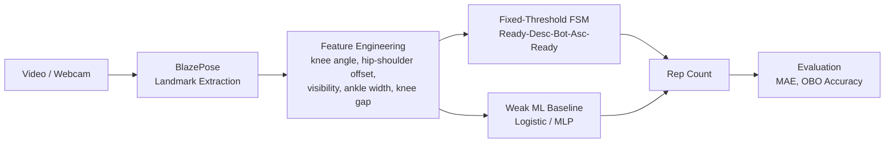
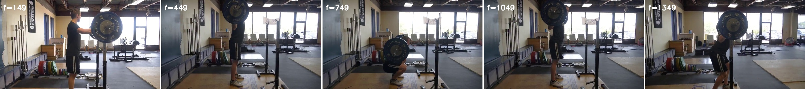
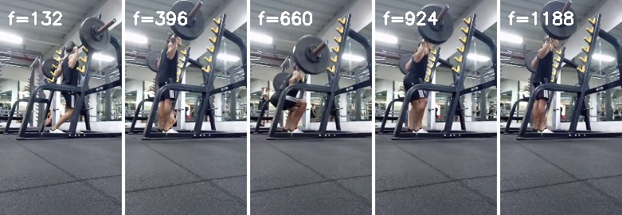
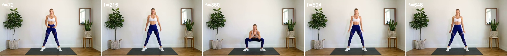

# Pose-Based Rep Counting: A Research Baseline

A camera-based repetition counting baseline that combines a transparent
rule-based finite state machine with weak-supervised learned baselines.
It provides a browser demo for live webcam recognition, an offline evaluation
pipeline on the RepCount squat subset, and a failure-case analysis that
documents where fixed thresholds break down — intended as a comparison point
for learning-based movement recognition methods.

The repository includes: (1) a live browser demo using BlazePose via MediaPipe,
(2) a fixed-threshold FSM offline evaluator (`eval.py`), (3) weak-supervised
ML baselines (logistic regression and MLP) trained on interval-derived phase
labels (`ml_baseline.py`), and (4) a deterministic sampling script for
reproducible evaluation splits. All metrics are reported as baseline results,
not as production accuracy claims.

## Research Question

How well can a transparent, hand-engineered rule-based recognizer count
movement repetitions from a single webcam under realistic variation in camera
angle, lighting, and body framing? Where does it fail, and what does that imply
for the design of a learning-based replacement?

## Pipeline



See [docs/method.md](docs/method.md) for the full state-machine specification,
threshold parameters, weak-label derivation, and feature-engineering details.

## Evaluation

Results below are on a deterministic 33-clip subset of the RepCount squat split
(Hu et al. 2022, via PoseRAC), sampled with seed 42. The full per-clip outputs
are in `results/eval.csv` and `results/ml_baseline_eval.csv`.
See [docs/evaluation.md](docs/evaluation.md) for metric definitions and
complete reproduction commands.

| Method | Clips | MAE | OBO accuracy |
|---|---|---|---|
| Fixed-threshold FSM | 33 | 7.455 | 6/33 = 0.182 |
| Weak logistic phase baseline | 33 | 4.424 | 19/33 = 0.576 |
| Weak MLP phase baseline (32-16 hidden) | 33 | 4.788 | 13/33 = 0.394 |

The FSM predicts 0 repetitions on 18 of 33 clips — evidence that fixed
thresholds do not generalise across camera viewpoints and exercise styles
without learning from data. The logistic baseline outperforms the MLP on this
subset; both are weakly supervised from interval annotations.

The `squant` spelling in category labels is preserved from the source annotation.

## Reproducing The Evaluation

```bash
# Create environment
python -m venv .venv
# macOS / Linux: source .venv/bin/activate
# Windows:       .venv\Scripts\activate
pip install -r requirements.txt
```

Download `RepCount_pose.tar.gz` from the
[PoseRAC project](https://github.com/MiracleDance/PoseRAC), then:

```bash
# Extract deterministic squat subset
python prepare_repcount_sample.py \
    --archive _downloads/RepCount_pose.tar.gz --count 33 --seed 42

# Rule-based FSM evaluation
python eval.py \
    --videos-csv data/videos.csv --videos-root data/videos \
    --out results/eval.csv

# Weak ML baseline (logistic + MLP)
python ml_baseline.py \
    --archive _downloads/RepCount_pose.tar.gz --videos-csv data/videos.csv \
    --out results/ml_baseline_eval.csv --max-train-clips 33
```

Same `--seed 42` produces the same `data/videos.csv` every run.

## Running The Browser Demo

```bash
python -m http.server 8000
```

Open `http://localhost:8000` in Chrome or Edge. Stand 2-3 meters from the
camera with the full body in frame.

### Browser Demo Modes

The demo loads the BlazePose model either from a local `models/` directory
or from the MediaPipe CDN, with local taking precedence.

- **Offline mode**: Place `pose_landmarker_lite.task` in `./models/`
  ([download from MediaPipe](https://developers.google.com/mediapipe/solutions/vision/pose_landmarker#models)).
  The demo runs with no network access after page load.
- **Online mode** (default fallback): The demo fetches the model from the
  MediaPipe CDN. Requires network at startup.

## Boundaries

This project is a movement-recognition research baseline. It is not intended
for health decisions, safety assessment, treatment advice, or coaching
certification.

## Limitations

- Rule-based recognizer with fixed thresholds, not trained on data.
- Performance degrades under heavy occlusion, low light, side views, partial
  body framing, or fast repetitions.
- 33-clip subset measurement, not a full benchmark.
- Weak labels are derived from interval midpoints, not per-frame annotations.
  See [docs/limitations.md](docs/limitations.md) for a detailed discussion.

## Failure Cases

Four representative FSM failures from `results/eval.csv`, each illustrating a
different failure mode. See [docs/limitations.md](docs/limitations.md) for a
broader discussion.

### (a) Frontal but shallow motion



`002_stu8_70.mp4`: ground truth 4, FSM 0, LR 2, MLP 5. The subject faces the
camera with upper body leaning forward. The knee angle stays above the
BOTTOM=112 threshold, so the FSM never registers a full cycle. Fixed
thresholds fail when body lean compresses the apparent knee flexion angle.

### (b) Side view


`033_stu5_62.mp4`: ground truth 32, FSM 18, LR 32, MLP 36. Side camera angle
causes one-side landmark occlusion, producing unstable knee-angle readings.
The FSM counts some cycles and misses others. LR recovers the full count;
MLP overshoots.

### (c) Partial body framing



`004_stu4_68.mp4`: ground truth 5, FSM 0, LR 5, MLP 20. The lower body is
partially cropped out of frame. Lower-body landmark visibility drops below the
0.55 threshold, resetting the FSM state machine. LR handles this clip
correctly; MLP overcounts substantially.

### (d) Fast movement with pose noise



`005_stu3_66.mp4`: ground truth 9, FSM 5, LR 10, MLP 10. Fast repetition tempo
combined with pose-estimation jitter causes the FSM to miss several cycles.
The stable-frames requirement (3 frames) filters some genuine transitions that
do not persist long enough. Both learned baselines come within OBO range.

## Future Work

1. Replace weak interval-derived labels with manually checked per-frame phase
   labels for a small subset.
2. Cross-subject evaluation: train on one subject group, test on another.
3. Extend to multi-exercise recognition (push-up, lunge).

## Related Work

- BlazePose / MediaPipe Pose: real-time 33-landmark body tracking.
- Hu et al. 2022, TransRAC: RepCount benchmark and OBO / MAE metrics.
- Yao et al. 2023, PoseRAC: pose-driven repetition counting, plus the public
  [RepCount_pose data package](https://github.com/MiracleDance/PoseRAC).
- Dwibedi et al. 2020, Counting Out Time: reference repetition-counting
  framework.
