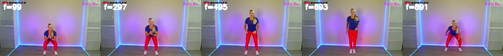

# Pose-Based Rep Counting: A Rule-Based Baseline

A small research baseline for camera-based human movement recognition. The
prototype takes a webcam stream, extracts BlazePose landmarks, and applies a
rule-based finite state machine to count squat repetitions. It is intended as
a study artifact and a starting point for comparing rule-based recognition
against learning-based methods on the same task.

## Research Question

How well can a transparent, hand-engineered rule-based recognizer count
movement repetitions from a single webcam under realistic variation in camera
angle, lighting, and body framing? Where does it fail, and what does that imply
for the design of a learning-based replacement?

## Method

1. **Pose extraction.** BlazePose through MediaPipe extracts 33 body landmarks
   per frame.
2. **Feature engineering.** Knee flexion angle, averaged across left and right,
   and hip-vs-shoulder vertical offset are computed from landmarks. Knee angle
   is smoothed with EMA alpha 0.35.
3. **State machine recognition.** A four-state machine
   (`Ready -> Descending -> Bottom -> Ascending -> Ready`) gates repetition
   counting on hysteresis thresholds, a stable-frame requirement, and cooldown.
4. **Browser demo.** `index.html` implements the live webcam version.
5. **Offline evaluation.** `eval.py` ports the same fixed-threshold state
   machine to Python so recorded videos can be evaluated with OBO accuracy and
   MAE after ground-truth counts are available.

The state-machine thresholds are intentionally fixed to match the browser demo:

| Parameter | Value |
|---|---:|
| lower-body visibility threshold | 0.55 |
| descend knee angle | 128.0 |
| bottom knee angle | 112.0 |
| ascend knee angle | 148.0 |
| top knee angle | 160.0 |
| stable frames | 3 |
| cooldown | 750 ms |
| EMA alpha | 0.35 |
| hip-below-shoulder offset | 0.14 |

## Evaluation

The current quantitative result is a small baseline run on 20 squat clips
extracted from the RepCount/PoseRAC data package. The clips are not committed
because the video data is large; `data/videos.csv` records the local manifest
used for the run, and `results/eval.csv` records the per-video outputs.

| Method | Dataset slice | Clips | MAE | OBO accuracy |
|---|---|---:|---:|---:|
| Fixed-threshold FSM | RepCount squat subset | 20 | 6.750 | 5/20 = 0.250 |
| Weak logistic phase baseline | RepCount squat subset | 20 | 4.800 | 13/20 = 0.650 |

This is intentionally reported as a baseline result, not as a formal accuracy
claim. The low score is useful evidence that the fixed-threshold recognizer is
fragile under dataset variation and should be compared against a learned stage
recognizer. The logistic baseline is weakly supervised: it derives approximate
up/down labels from repetition intervals rather than from manually annotated
per-frame movement phases.

Manifest format:

```csv
video_path,gt_count,category
repcount_squat/001_val1244.mp4,1,repcount_test_squant
repcount_squat/002_val1257.mp4,2,repcount_test_squant
```

The `squant` spelling is preserved from the source annotation label.

## Reproducing The Evaluation

Create an environment and install dependencies:

```bash
python -m venv .venv
.venv\Scripts\activate
pip install -r requirements.txt
```

Download `RepCount_pose.tar.gz` from the
[PoseRAC project](https://github.com/MiracleDance/PoseRAC), then extract a
deterministic squat subset:

```bash
python prepare_repcount_sample.py --archive _downloads\RepCount_pose.tar.gz --count 20
```

Run evaluation:

```bash
python eval.py --videos-csv data/videos.csv --videos-root data/videos --out results/eval.csv
```

`eval.py` prints MAE and OBO accuracy and writes the per-clip outputs to
`results/eval.csv`.

Run the weak learning-based baseline:

```bash
python ml_baseline.py --archive _downloads\RepCount_pose.tar.gz --videos-csv data/videos.csv --out results/ml_baseline_eval.csv --max-train-clips 20
```

`ml_baseline.py` trains a small logistic classifier on pose features extracted
from 20 `video_train` squat clips, then counts down-to-up transitions on the
same 20 evaluation clips used by the FSM baseline. It caches extracted training
videos under `_downloads/`, which is ignored by git.

## Running The Browser Demo

```bash
python -m http.server 8000
```

Open `http://localhost:8000` in Chrome or Edge. Stand 2-3 meters from the
camera with the full body in frame.

## Boundaries

This project is a movement-recognition research baseline. It is not intended
for health decisions, safety assessment, treatment advice, or coaching
certification.

## Limitations

- Rule-based recognizer, not trained on data.
- Performance may degrade under heavy occlusion, low light, side views, partial
  body framing, or very fast repetitions.
- The current result is a 20-clip subset measurement, not a full benchmark.
- Several clips produce zero counts because the fixed thresholds do not survive
  camera/viewpoint and pose-estimation variation.

## Failure Cases

The two examples below are from `results/eval.csv` and illustrate why the
rule-based baseline is useful but brittle.



`015_stu6_65.mp4`: ground truth 19, predicted 0. The subject stays visible, but
the fixed knee-angle thresholds do not register the movement as a full
`Descending -> Bottom -> Ascending` cycle. This suggests the hand-tuned
thresholds are not invariant to exercise style and camera geometry.


`008_stu5_62.mp4`: ground truth 32, predicted 18. The side view and outdoor
scene produce a more unstable lower-body pose signal, so the recognizer counts
some cycles and misses others. This is a concrete target for a learned
stage-recognition baseline.

## Future Work

1. Replace weak interval-derived labels with manually checked per-frame phase
   labels for a small subset.
2. Expand the evaluation split after the failure cases are understood.
3. Add per-frame diagnostics for knee angle, visibility, and state transitions.

## Related Work

- BlazePose / MediaPipe Pose: real-time 33-landmark body tracking.
- Hu et al. 2022, TransRAC: RepCount benchmark and OBO / MAE metrics.
- Yao et al. 2023, PoseRAC: pose-driven learning approach to repetition
  counting, plus the public
  [RepCount_pose data package](https://github.com/MiracleDance/PoseRAC) used
  by `prepare_repcount_sample.py`.
- Dwibedi et al. 2020, Counting Out Time: reference repetition-counting
  framework.
